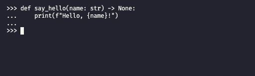
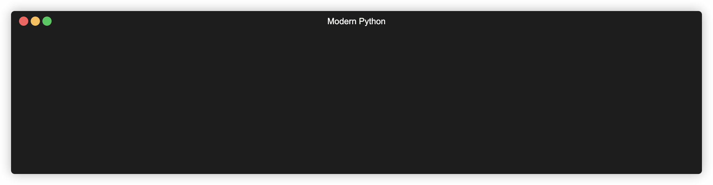
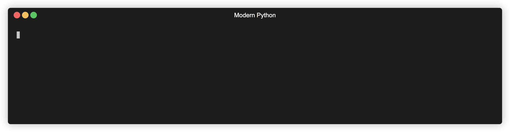

# **Modern Python** 🐍

## Like Regular Python, But Better

---
## **What's wrong with how I write Python now?**

Nothing (necessarily)

---

## **New isn't always better**

* Just because I like it doesn't mean you have to
* Take what you like, and leave what you don't

---

* Dataclasses (incl. pydantic)
* Structural pattern matching

---

## ✨ **Type hints** ✨

From this:

```python
def shout(word):
    print(f"{str.upper(word)}!")
```

To this:

```python
def shout(word: str) -> None:
    print(f"{str.upper(word)}!")
```

---

>Type hints help us **document our code more easily** and **catch errors early**.

---

## **But isn't Python dynamically typed?** 🤔

⚠️ Type hints are **aesthetic**, they don't actually enforce anything in our code. ⚠️

<br/>



---

## **Type aliases**

```python
Point = tuple[float, float]

def scale(point: Point, factor: float) -> Point:
    return (factor * point[0], factor * point[1])


UserId = str

def delete_users(users: list[UserId]) -> None:
    for user in users:
        # Some logic here
```

---

## **Built-ins vs. `from typing import ...`**

```python
from typing Dict, List, Tuple


foo = List[int]
bar = list[int]

baz = Tuple[float, float]
qux = tuple[float, float]

spam = Dict[str, str]
ham = dict[str, str]
```

Built-ins are preferred (e.g., `list`, `dict`).

___

## **We can type-hint functions too**

```python
from typing import Any, Callable, Sequence


def apply(func: Callable[[Any], Any], values: Sequence[Any]) -> list[Any]:
    return [func(value) for value in values]

values = (1, 2, 3)
double = lambda x: 2 * x
applied_values = apply(double, values) # [2, 4, 6]
```

---

## **Avoid `Any` wherever you can**

* When we use `Any`, we're basically adding a type hint for the sake of it
* Objects annotated with `Any` **do not** get type checked
* We can leave `Any` out and it will be inferred by a type checker

```python
from typing import Callable, Sequence


def apply(func: Callable, values: Sequence) -> list:
    return [func(value) for value in values]
```

---

## **What exactly is a `Sequence`?**

* Originates in `collections.abc`

* An interface that defines `__getitem__` and `__len__` abstract methods

* Classes like `list`, `tuple` and `str` are *"virtual subclasses"* of `Sequence`

```python
from typing import Sequence


issubclass(list, Sequence) # True
issubclass(tuple, Sequence) # True
issubclass(str, Sequence) # True
```

---

## **Typed generics**

```python
from typing import Callable, Sequence, TypeVar


T = TypeVar("T")
U = TypeVar("U")


def apply(func: Callable[[T], U], values: Sequence[T]) -> list[U]:
    return [func(value) for value in values]


def first(values: Sequence[T]) -> T | None:
    return values[0] if len(values) != 0 else None
```

---

## **General in → specific out**

> If functions or methods only need their inputs to have generic behaviours (e.g., the ability to be sequenced or iterated over), then consider using ABCs in type annotations to maintain flexibility.

<br/>

ABCs like `Sequence`, `Mapping`, `Iterable` and `Iterator` are all just interfaces with abstract methods for us to override (usually dunder methods like `__get__` or `__next__`).

---

## **What if I want to subtype *my own* classes?**

```python
from typing import Generic, TypeVar


T = TypeVar("T")

class MagicList(Generic[T]):
    def __init__(self, *args: T) -> None:
        ...


magic_list: MagicList[int] = MagicList(1, 2, 3)
```

---

## **Nominal vs. structural typing**

Nominal → compatibility determined from declared type - ***"is it?"***
Structural → compatibility determined from structure - ***"does it?"***

---

## **Interfaces - ABCs or Protocols?**

* Languages like Java make a distinction between *interfaces* and *abstract classes*
* In Python, we talk about interfaces and abstract classes interchangeably
* When we talk about an interface, we're really just thinking of a *blueprint*
* We can define an interface using either `abc.ABC` or `typing.Protocol`

---

## **Using `abc.ABC` fits a nominal typing style**

```python
from abc import ABC, abstractmethod


class Sizeable(ABC):

    @abstractmethod
    def size(self) -> int:
        ...
```

---

To use an ABC, we have to explicitly inherit from the parent class.

```python
def is_empty(container: Sizeable) -> bool:
    return container.size() == 0


class Trolley(Sizeable):
    def __init__(self, items: list[str]) -> None:
        self.items = items

    def size(self) -> int:
        return len(self.items)

    def add_item(item: str) -> None:
        self.items = [*self.items, item]


trolley = Trolley(["Bread", "Milk", "Eggs"])
print(is_empty(trolley)) # False

```

---

## **Using `typing.Protocol` fits a structrual style**

Protocols let us make use of static duck-typing and help us to define generic type bounds.

```python
from typing import Protocol


class Sizeable(Protocol):

    def size(self) -> int:
        ...
```

---

```python
def is_empty(container: Sizeable) -> bool:
    return container.size() == 0


class Trolley:  # No need to inherit from Sizeable
    def __init__(self, items: list[str]) -> None:
        self.items = items

    def size(self) -> int:
        return len(self.items)

    def add_item(item: str) -> None:
        self.items = [*self.items, item]


trolley = Trolley(["Bread", "Milk", "Eggs"])
print(is_empty(trolley)) # False
```

---

Python is already duck-typed, so couldn't we just have left out type annotations and still run the program as normal?

(Yes 😬)

---

## **Is it worth all the effort?**

* To really take advantages of type hints, we need to use a **static type checker**
* We incoporate type checkers into our workflow and flag when type checking fails
* We try to convert runtime errors into pre-runtime errors from the type checker

---

## **Mypy to the rescue**

* Most popular static type checker for Python
* CLI support and IDE integration (e.g., VS Code, IntelliJ IDEs)
* Active contributors include Guido van Rossum
* Installed like any Python package (`pip`, `poetry`, `conda` etc.)

---

## **How does it work?**

```python
# my_module.py
from typing import Protocol


class Sizeable(Protocol):

    def size(self) -> int:
        ...


def is_empty(container: Sizeable) -> bool:
    return container.size() == 0


my_list = [1, 2, 3]
print(is_empty(my_list))
```

---

Without a type checker, we only find out about errors in our code when we run it:



---

With a type checker like Mypy, we flag the type error before ever running the code:



---

## **Mypy type checker**

---

* Mypy and linters (show things like config to enforce no use of `Any`)
* Pre-commit

---

## **References**

* [PEP-484 - Type Hints](https://peps.python.org/pep-0484/)
* [`collections.abc` documentation](https://docs.python.org/3/library/collections.abc.html)
* [`Sequence` source code](https://github.com/python/cpython/blob/8bb16f665691b2869e107e180208d28b292bf3bd/Lib/_collections_abc.py#L973-L1039) - take a look to see how virtual subclasses are defined with `Sequence.register`
* [Mypy docs](https://mypy.readthedocs.io/en/stable/)
