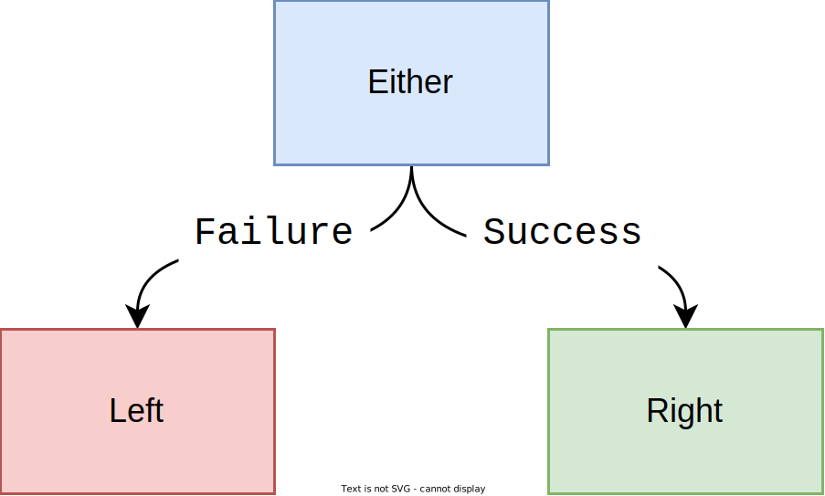
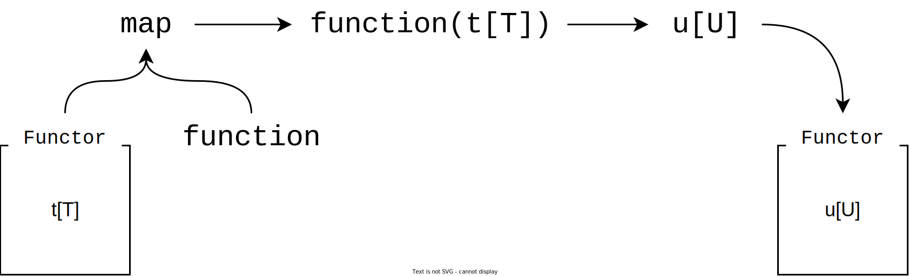
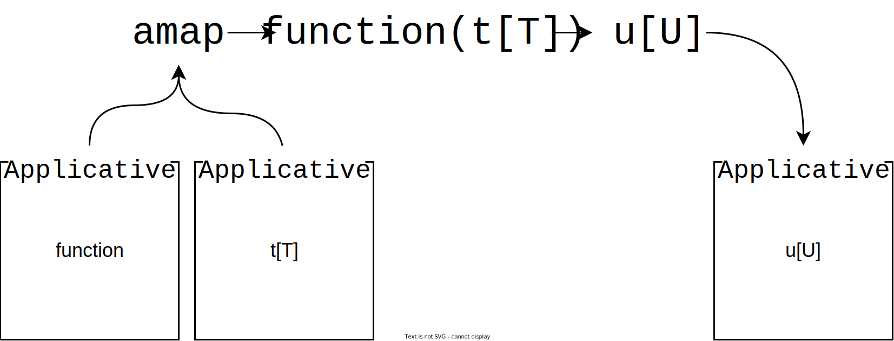
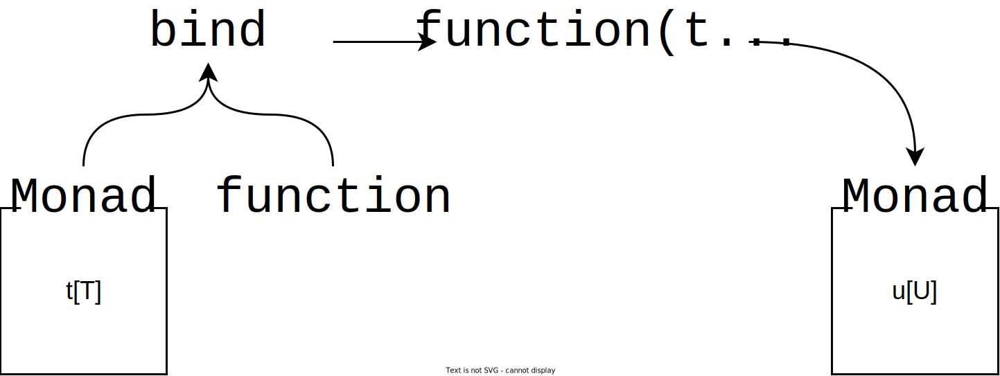

# **Monads in Python**

## How They Work & Why You Shouldn't Use Them

---

## **...who cares?** 🫠

* Functional programming without an understanding of Monads is hard
* Pure functional languages like Haskell use Monads everywhere
* Lots of FP resources are framed in the context of Haskell

---

## **What makes code functional?**

> Functional programming is about building functionality through the composition of pure functions.

---

## **Intermediary variables are for losers**

We could do this:

```python
f_result = f(x)
g_result = g(f_result)
h_result = h(g_result)
```

...or we could cut out the middle man:

```python
h_result = h(g(f(x)))
```

If only there was a prettier way to do this 🥺...

---

## **What makes a function "pure"?**

* Referential transparency
* Freedom from side-effects

---

### ✨ Pure ✨

```python
def add(a: int, b: int) -> int:
    return a + b
```

✅ Referentially transparent
✅ Free from side-effects

</br>

### 🤮 Impure 🤮

```python
def add(a: int, b: int) -> int:
    print(f"Adding {a} and {b}.")
    return a + b
```

❌ Referentially transparent
❌ Free from side-effects

---

### **Some things a pure function can't do** 🙃

* Log
* Interact with files, databases or REST APIs
* Generate random numbers
* Handle/raise exceptions

---

## **...so how do we get anything done?** 😒

> Functors, Applicatives and Monads help us handle side-effects and compose functions together

---

## **What's a Functor?**

A way to wrap a value in order to **encode behaviour**.

---

### **Exceptions with `Either`**

<!-- markdownlint-disable MD033 -->
<style>
img[alt~="center"] {
  display: block;
  margin: 0 auto;
}
</style>

<br />



---

When `b == 0`, a `ZeroDivisionError` is raised.

```python
def divide(a: float, b: float) -> float:
    return a / b
```

---

Even when `b == 0`, no exception is raised and we consistently return an instance of `Either`.

```python
from pymonad.either import Either, Left, Right


def divide(a: float, b: float) -> Either[ZeroDivisionError, float]:
    if b == 0:
        return Left(ZeroDivisionError)
    else:
        return Right(a / b)
```

---

> Using a Functor, we've been able to encode the occurrence of an exception without compromising purity.

---

## **Pure functions are honest** 😇

 > The type signature of a pure function tells us about the good days *and* the bad days

---

## **How do we get values out of `Either`?**

```python
success = divide(1.0, 2.0)
failure = divide(1.0, 0.0)

# 0.5
success.either(
    lambda left: print(left),
    lambda right: print(right)
)

# ZeroDivisionError
failure.either(
    lambda left: print(left),
    lambda right: print(right)
)
```

---

## **How do we use Functors with normal functions?**

```python
add_one = lambda a: a + 1
zero_point_five = divide(1.0, 2.0)

# TypeError: unsupported operand type(s) for +: 'Either' and 'int'
add_one(zero_point_five)

```

---

## **Function composition with `map`**

We can use a Functor's `map` method to compose functions.

```python
def map(self: "Functor[T]", function: Callable[[T], U]) -> "Functor[U]": ...
```

<!-- markdownlint-disable MD033 -->
<style>
img[alt="center"] {
  display: block;
  margin: 0 auto;
}
</style>

<br />



---

## **Round peg, round hole**

Instead of passing an `Either` straight into `add_one`, we just use its `map` method.

```python
result = divide(1.0, 2.0).map(add_one)

# 1.5
result.either(
    lambda left: print(left),
    lambda right: print(right)
)
```

---

## **Compose to your heart's content**

```python
add_ten = lambda a: a + 10
multiply_by_two = lambda a: a * 2
cube = lambda a: a ** 3
convert_to_int = lambda a: int(a)
format_as_string = lambda a: f"{a:,}"

result = (
    divide(4.0, 2.0)
    .map(add_ten)
    .map(multiply_by_two)
    .map(cube)
    .map(convert_to_int)
    .map(format_as_string)
)

# 13,824
result.either(
    lambda left: print(left),
    lambda right: print(right)
)
```

---

## **There isn't much more to a Functor**

Functors are just a means to:

* Handle side-effects to maintain functional purity
* Compose functions

---

## **How do we use multi-parameter functions in a composition chain?**

> Currying converts a function of `n` parameters into `n` functions, each with a single parameter.

<br />

```python
from pymonad.tools import curry

@curry(2)
def add_n(n: int, a: int) -> int:
    return a + n

add_one = add_n(1)

# 2, 2
print(add_one(1), add_n(1)(1), sep=", ")
```

---

```python
result = (
    divide(1.0, 2.0)
    .map(add_n)
    . # Erm...what now?
)
```

* `map(add_n)` returns a function wrapped in a Functor
* We can't use another call to `map` to pass a value into the function because `map` doesn't know what to do with a function wrapped in a Functor

---

## **What's an Applicative?**

Applicatives are like Functors but they define a different method, this time called `amap`

```python
def amap(self: "Applicative[Callable[[T], U]]", value: "Applicative[T]") -> "Applicative[U]": ...
```

<!-- markdownlint-disable MD033 -->
<style>
img[alt~="center"] {
  display: block;
  margin: 0 auto;
}
</style>

<br />



---

## **How is `amap` useful to us?**

> `Either` is a Functor because it defines an `map` method, but it's also an Applicative because it also defines an `amap` method.

</br>

```python
result = (
    divide(1.0, 2.0) # Right(0.5)
    .map(add_n) # Right(<add_n, n=0.5>)
    .amap(Right(0.5)) # Right(1.0)
)

# 1.0
result.either(
    lambda left: print(left),
    lambda right: print(right)
)
```

---

## **It turns out that Applicatives aren't too bad either**

Applicatives combined with currying allow to:

* Use multi-parameter functions in composition
* Pass values from outside the chain into functions

---

## **We're *finally* ready to talk about Monads?**

* Surprise! 🎉 `Either` is also a Monad!
* Lots things are Functors, Applicatives *and* Monads
* This isn't always the case, e.g., PyMonad's `Writer` Monad doesn't have an `amap` method.

---

## **`map`, `amap` and...?**

Just like Functors and Applicatives, Monads have a special method, and their method is called `bind`.

```python
def bind(self: "Monad[T]", function: Callable[[T], "Monad[U]"]) -> "Monad[U]": ...
```

<!-- markdownlint-disable MD033 -->
<style>
img[alt="center"] {
  display: block;
  margin: 0 auto;
}
</style>

<br />



---

## **This looks suspciously like `map`...when would I need this?**

Using `bind` let's us compose Monadic functions (instead of normal, every-day functions)

---

```python
from pymonad.either import Either, Left, Right
from pymonad.tools import curry

@curry(2)
def divide(b: float, a: float) -> Either[ZeroDivisionError, float]:
    return Left(ZeroDivisionError) if b == 0 else Right(a / b)

divide_by_three = divide(3.0)
double = lambda x: 2 * x

result = (
    divide(1.0, 2.0)
    .map(double)
    .bind(divide_by_three)
)

# Result: 1.3
result.either(
    lambda left: print(left),
    lambda right: print(round(right, 1))
)
```

---

## **In summary**

* Functors, Applicatives and Monads are all a means of maintaing functional purity
* They each define a method which lets us compose functions under different circumstances
* Most of the time, "Monad" is synoymous with Functor and Applicative

---

## **Should we bother with Monads in Python at all?**

...probably not.

<!-- markdownlint-disable MD033 -->
<style>
img[alt~="center-rounded-shadow"] {
  display: block;
  margin: 0 auto;
  border-radius: 7.5%;
  box-shadow: rgba(100, 100, 111, 0.8) 0px 7px 29px 0px;
}
</style>


---

## **Monads aren't Pythonic**

<br />

* Python shouldn't look like Haskell, Scala, Clojure, OCaml, F#, Lisp, ML etc.
* You're not the only person who has to maintain your code
* Heavy use of Monads stops Python looking and behaving like Python
* We only talked about *one* Monad, but there are tons more, e.g., `Reader`, `Writer`, `State`, `IO`, `Maybe`

---

## **What was actually useful about Monads?**

* Easy function composition
* Encoding behaviour in function signatures

---

## **You don't need Monads to write functional code**

* We can achieve most of the benefits of FP without Monads (e.g., don't mutate global state, build functionality through small, composable functions)
* Packages exist to enable piping and composition (e.g., `functoolz`) without needing to introduce the kinds of complexity Monads bring

---

## **Sometimes, we don't get a choice**

* Frameworks often enforce certain programming styles, e.g., if we want a Databricks pipeline to fail, we *have* to raise an exception!

---

## **Don't be a zealout**

> When it comes to FP, we should be pragmatic, taking the parts of the paradigm that work for us and make our code better and not worrying ourselves too much about the parts that don’t.

---

## **References**

1. [Learn You a Haskell For Great Good (Miran Lipovača)](http://learnyouahaskell.com)
2. [Functors, Applicatives and Monads in Pictures (Adit Bhargava)](https://www.adit.io/posts/2013-04-17-functors,_applicatives,_and_monads_in_pictures.html)
3. [Functional Programming Simplified (Alvin Alexander)](https://fpsimplified.com)
4. [An Introduction to Functional Programming (Mary Rose Cook)](https://codewords.recurse.com/issues/one/an-introduction-to-functional-programming)
5. [Map And Bind And Apply, Oh My! (F# for Fun and Profit)](https://fsharpforfunandprofit.com/posts/elevated-world/#series-toc)
