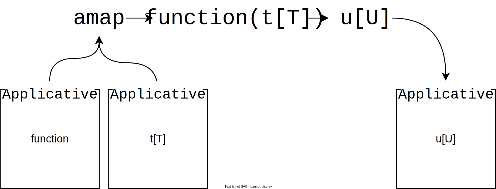
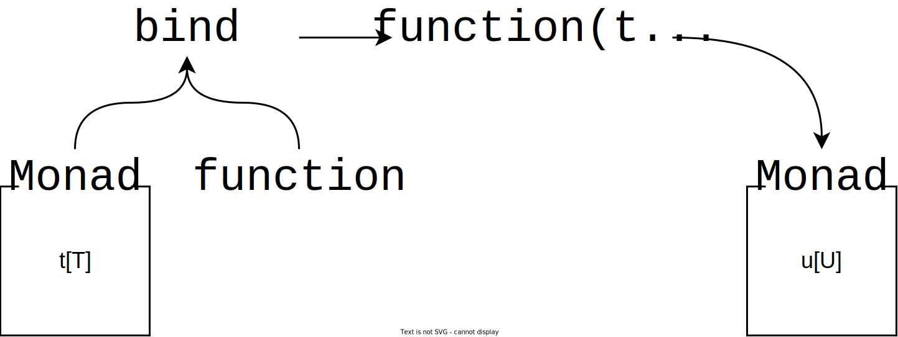
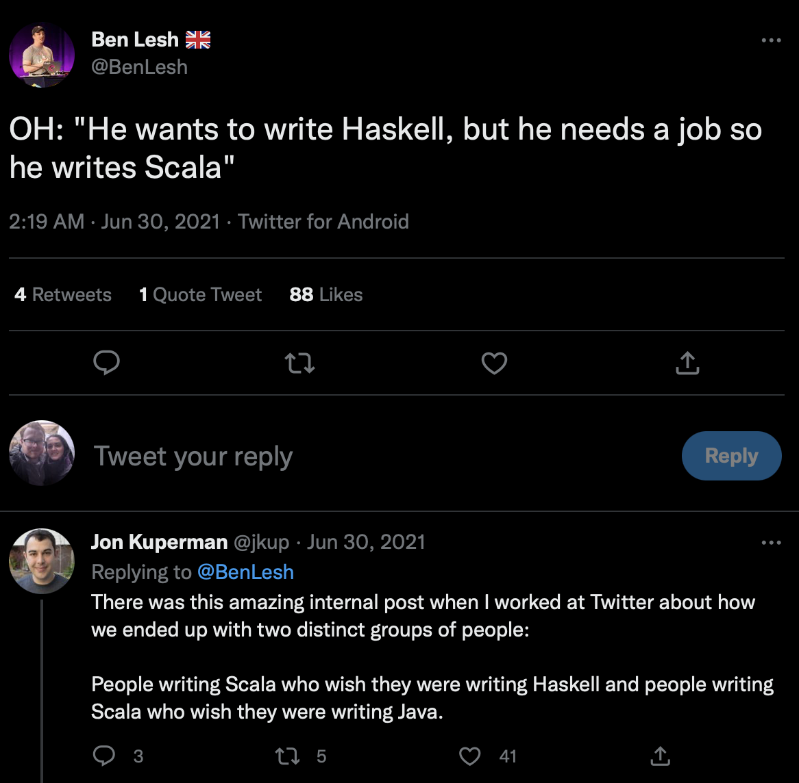

# **Monads in Python**

## How They Work & Why You Shouldn't Use Them

---

## **...who cares?** 🫠

* Functional programming without an understanding of Monads is hard
* Pure functional languages like Haskell use Monads everywhere
* Lots of FP resources are framed in the context of Haskell

---

## **What makes code functional?**

> Functional programming is about building functionality through the composition of pure functions.

---

## **Intermediary variables are for losers**

We could do this:

```python
f_result = f(x)
g_result = g(f_result)
h_result = h(g_result)
```

...or we could cut out the middle man:

```python
h_result = h(g(f(x)))
```

(If only there was a prettier way to do this 🥺)

---

## **What makes a function "pure"?**

* Referential transparency
* Freedom from side-effects

---

### ✨ Pure ✨

```python
def add(a: int, b: int) -> int:
    return a + b
```

✅ Referentially transparent
✅ Free from side-effects

</br>

### 🤮 Impure 🤮

```python
def add(a: int, b: int) -> int:
    print(f"Adding {a} and {b}.")
    return a + b
```

❌ Referentially transparent
❌ Free from side-effects

---

### **Some things a pure function can't do** 🙃

* Log to console, file, stream etc.
* Read/write files
* Read from/write to a database
* Get user input
* Generate random numbers
* Call a REST API
* Raise exceptions

---

## **...so how do we get anything done?** 😒

> Functors, Applicatives and Monads help us handle side-effects and compose functions together

---

## **What's a Functor?**

A way to wrap a value in order to **encode behaviour**.

</br>

Sometimes spoken about as:

* "A box we put values into"
* "A value wrapped in a computational context"

---

### **Exception handling with `Either`**

<!-- markdownlint-disable MD033 -->
<style>
img[alt~="center"] {
  display: block;
  margin: 0 auto;
}
</style>

</br>


---

When `b == 0`, a `ZeroDivisionError` is raised.

```python
def divide(a: float, b: float) -> float:
    return a / b
```

---

Even when `b == 0`, no exception is raised and we consistently return an instance of `Either`.

```python
from pymonad.either import Either, Left, Right


def divide(a: float, b: float) -> Either[ZeroDivisionError, float]:
    if b == 0:
        return Left(ZeroDivisionError)
    else:
        return Right(a / b)
```

---

## **Pure functions are honest** 😇

 > The type signature of a pure function tells us about the good days *and* the bad days

---

## **I have this dream where I'm trapped in a Functor and I can't get out**

How do we get values out of `Either`?

```python
success = divide(1.0, 2.0)
failure = divide(1.0, 0.0)

# 0.5
success.either(
    lambda left: print(left),
    lambda right: print(right)
)

# ZeroDivisionError
failure.either(
    lambda left: print(left),
    lambda right: print(right)
)
```

---

## **You can't fit a square peg in a round hole**

How do we pass an `Either` into a normal function?

```python
add_one = lambda a: a + 1
zero_point_five = divide(1.0, 2.0)

# TypeError: unsupported operand type(s) for +: 'Either' and 'int'
add_one(zero_point_five)

```

---

## **Compose like Beethoven with `fmap`**

We can use a Functor's `fmap` method to compose functions.

```python
def fmap(self: "Functor[T]", function: Callable[[T], U]) -> "Functor[U]": ...
```

<!-- markdownlint-disable MD033 -->
<style>
img[alt="center"] {
  display: block;
  margin: 0 auto;
}
</style>

</br>


---

## **Round peg, round hole**

Instead of passing an `Either` straight into `add_one`, we just use its `map` method.

```python
result = divide(1.0, 2.0).map(add_one)

# 1.5
result.either(
    lambda left: print(left),
    lambda right: print(right)
)
```

Annoyingly, PyMonad renamed `fmap` to `map` in its latest release 👎

---

## **Compose to your heart's content**

```python
add_ten = lambda a: a + 10
multiply_by_two = lambda a: a * 2
cube = lambda a: a ** 3
convert_to_int = lambda a: int(a)
format_as_string = lambda a: f"{a:,}"

result = (
    divide(4.0, 2.0)
    .then(add_ten)
    .then(multiply_by_two)
    .then(cube)
    .then(convert_to_int)
    .then(format_as_string)
)

# 13,824
result.either(
    lambda left: print(left),
    lambda right: print(right)
)
```

---

## **There isn't much more to a Functor**

Functors are just a means to:

* Handle side-effects to maintain functional purity
* Compose functions

---

## **All this talk of curry is making me hungry**

> Currying converts a function of `n` parameters into `n` functions, each with a single parameter.

</br>

```python
from pymonad.tools import curry

@curry(2)
def add_n(n: int, a: int) -> int:
    return a + n

add_one = add_n(1)
add_two = add_n(2)

# 2, 3
print(add_one(1), add_two(1), sep=", ")
```

---

## **What happens if we want to use a curried function directly in a composition chain?**

```python
result = (
    divide(1.0, 2.0)
    .map(add_n)
    . # Erm...what now?
)
```

* `map(add_n)` returns a function wrapped in a Functor
* We can't use another call to `map` to pass a value into the function because `map` doesn't know what to do with a function wrapped in a Functor


---

## **What's an Applicative?**

Applicatives are like Functors but they define a different method, this time called `amap`

```python
def amap(self: "Applicative[Callable[[T], U]]", value: "Applicative[T]") -> "Applicative[U]": ...
```

<!-- markdownlint-disable MD033 -->
<style>
img[alt~="center"] {
  display: block;
  margin: 0 auto;
}
</style>

</br>



---

## **How is `amap` useful to us?**

> `Either` is a Functor because it defines an `fmap` method, but it's also an Applicative because it also defines an `amap` method.

</br>

```python
result = (
    divide(1.0, 2.0) # Right(0.5)
    .map(add_n) # Right(<add_n, n=0.5>)
    .amap(Right(0.5)) # Right(1.0)
)

# 1.0
result.either(
    lambda left: print(left),
    lambda right: print(right)
)
```

---

## **It turns out that Applicatives aren't too bad either**

Applicatives combined with currying allow to:

* Use multi-parameter functions in composition
* Pass values from outside the chain into functions

---

## **We're *finally* ready to talk about Monads?**

* Surprise! 🎉 `Either` is also a Monad!
* Lots things are Functors, Applicatives *and* Monads
* This isn't always the case, e.g., PyMonad's `Writer` Monad doesn't have an `amap` method.

---

## **`map`, `amap` and...?**

Just like Functors and Applicatives, Monads have a special method, and their method is called `bind`.

```python
def bind(self: "Monad[T]", function: Callable[[T], "Monad[U]"]) -> "Monad[U]": ...
```

<!-- markdownlint-disable MD033 -->
<style>
img[alt="center"] {
  display: block;
  margin: 0 auto;
}
</style>

</br>



---

## **This looks suspciously like `map`...when would I need this?**

Using `bind` let's us compose Monadic functions (instead of normal, every-day functions)

---

```python
import os

from pymonad.either import Either, Left, Right
from pymonad.tools import curry


def get_env(var: str) -> Either[KeyError, str]:
    try:
        return Right(os.environ[var])
    except KeyError as e:
        return Left(e)

@curry(2)
def divide(b: float, a: float) -> Either[ZeroDivisionError, float]:
    if b == 0:
        return Left(ZeroDivisionError)
    else:
        return Right(a / b)


divide_by_two = divide(2.0)

# Normally, this would already be set in the environment.
os.environ["NUMBER"] = "10"

result = (
    get_env("NUMBER")
    .map(lambda num: float(num))
    .bind(divide_by_two)
    .map(lambda num: num * 1_000)
    .map(lambda num: f"{num:,.0f}")
)

# 5,000
resut.either(
    lambda left: print(left),
    lambda right: print(right)
)
```

---

## ✋ **Erm, shouldn't you be using the IO Monad?**

* We've been using `Either`, even for I/O actions - FP purists would call us out for this
* In languages like Haskell, we'd use `IO`

---

## **How does the `IO` Monad work?**

`IO` wraps side-effecting functions and delays their execution.

```python
import os

from pymonad.io import IO, _IO


def get_env(var: str) -> _IO:
    return IO(lambda: os.environ[var])


os.environ["MY_VAR"] = "My environment variable"
my_var = get_env("MY_VAR")

# Type: <class 'pymonad.io._IO'>, value: <pymonad.io._IO object at 0x10095a890>
print(f"Type: {type(my_var)}, value: {my_var}")
```

---

## **To get execute the function, we need to call the `run` method**

```python
my_var = get_env("MY_VAR")

# My environment variable
print(my_var.run())
```

</br>

* `IO` is considered pure because it doesn't actually execute anything
* `IO` contains *instructions* on how to perfom `IO`
* A function using `IO` always returns a consistent result, i.e., an instance of `_IO`

---

## **Did you buy that?**

> If it looks like a duck, swims like a duck and quacks like a duck, then it's probably a duck.

</br>

* Are functions really pure just because we delay their execution?
* If anything, all `IO` tells us is that the function is *definitely* doing something impure
* `IO` alone still blows up on an error once we do run it
* PyMonad doesn't support Monad transformers

---

## **Just use a type alias**

```python
import os
from typing import TypeAlias

from pymonad.either import Either, Left, Right


EnvironmentIO: TypeAlias = Either[KeyError, str]


def get_env(var: str) -> EnvironmentIO:
    try:
        return Right(os.environ[var])
    except KeyError as e:
        return Left(e)
```

---

## **Should we bother with Monads in Python at all?**

...probably not.

<!-- markdownlint-disable MD033 -->
<style>
img[alt~="center-rounded-shadow"] {
  display: block;
  margin: 0 auto;
  border-radius: 7.5%;
  box-shadow: rgba(100, 100, 111, 0.8) 0px 7px 29px 0px;
}
</style>



---

## **Square peg, round hole (again)**
  
> Monads aren't Pythonic.

</br>

* Python shouldn't look like Haskell, Scala, Clojure, OCaml, F#, Lisp, ML etc.
* You're not the only person who has to maintain your code
* Heavy use of Monads stops Python looking and behaving like Python

---

## **What was actually useful about Monads?**

* Easy function composition
* Encoding behaviour in function signatures

---

## **Don't be a zealout**

> When it comes to FP, we should be pragmatic, taking the parts of the paradigm that work for us and make our code better and not worrying ourselves too much about the parts that don’t.
